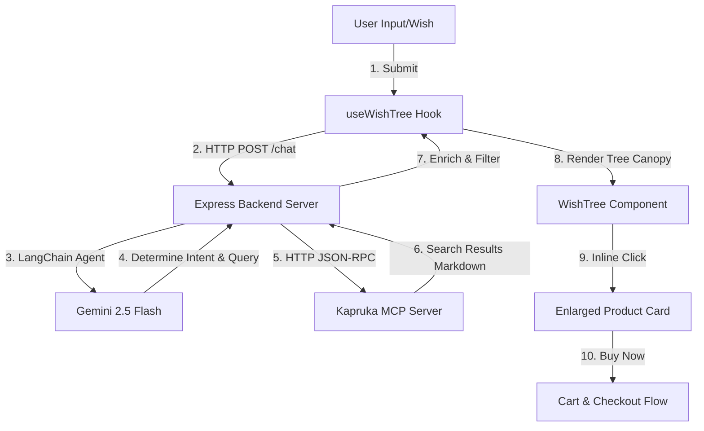

# Implementation and Gap Analysis

This document provides a detailed breakdown of the current end-to-end user flow, what has been implemented, how it integrates with the Kapruka MCP, and what functionality is currently missing or could be improved based on the available MCP endpoints.

---

## 1. How the Flow Works Right Now (In-Detail)

### Step 1: User Wish Submission
- The user enters a wish (e.g., *"Suggest a birthday gift for my mom under LKR 10,000"*) in the `WishInputBar` component.
- The `WishInputBar` handles form submission and forwards the query to the `handleSubmit` function in `useWishTree.ts`.

### Step 2: Backend AI Processing
- `useWishTree.ts` calls `parseUserQuery` in `useKaprukaAgent.ts`, which makes an HTTP POST request to `/chat` on the Express backend (`server/index.js`).
- The backend (`server/agent.js`) instantiates a LangChain agent powered by **Gemini 2.5 Flash** using the user's API key.
- The agent determines the user's core intent: `'search'`, `'add_to_cart'`, `'remove_from_cart'`, or `'checkout'`.

### Step 3: MCP Querying (Search)
- If the intent is `'search'`, the agent extracts search parameters (recipient, occasion, budget limits) and generates a optimized search query (e.g., *"saree"* or *"birthday cake"* instead of generic terms like *"gift"*).
- The backend communicates with the Kapruka MCP server at `https://mcp.kapruka.com/mcp` using a JSON-RPC session handshake (`initialize` and `tools/call` methods).
- It calls the `kapruka_search_products` tool.
- **Failover Logic**: If the search yields 0 products or the API key hits a **429 Rate Limit**, the backend automatically falls back to the next available API key from the user's configured list in `.env.local` to retry the request.

### Step 4: Frontend Tree Mapping & Interaction
- The search results (Markdown) are parsed into JSON products, enriched with scraped/cache images, and returned to the frontend.
- `useWishTree.ts` maps these products onto the spatial coordinates of the visual tree canopy (`WishTree.tsx`).
- **Inline Product Expansion**: When a user clicks a product node (e.g., a birthday cake):
  - The node expands smoothly to occupy a central region of the canopy (`width: 76%`, `height: 52%`, `top: 8%`), staying perfectly within the tree canopy bounds and avoiding the Kapruka "u" smile.
  - The surrounding nodes and foliage temporarily fade out (`opacity: 0.2`) to focus attention.
  - The expanded card displays a responsive split-view: the product image on the left, and the full description/price/actions on the right (scrollable on mobile).
  - A contextual floating badge appears above the chat input: *"Chatting about: [Product Name]"*.
  - The user can click a cart icon or "Buy Now" to directly trigger cart actions.

---

## 2. What Has Been Implemented

- **Dynamic Visual Canopy Mapping**: Dynamic placement of labels (occasion, recipient, budget) and product leaf nodes.
- **Interactive Inline Card**: Click-to-expand card layout natively nested inside the SVG tree space, featuring a 2-column layout (Left: Image, Right: Details), mobile responsiveness, and scrolling support.
- **Floating Badge Context**: Contextual shift UI above the text bar when chatting about a product.
- **Gemini API Key Failover**: Automated rotation between three separate Gemini API keys to bypass rate limits (429).
- **Backend-Forwarded Checkout**: A `CheckoutSummary` component that calls `kapruka_create_order` to create guest orders.

---

## 3. What Has Been Missed (Gaps)

Based on the full suite of Kapruka MCP endpoints, the following functions and components are currently disconnected or missing in the user experience:

### Gap A: Delivery Checking (`kapruka_check_delivery` & `kapruka_list_delivery_cities`)
- **What is missing**: The ability to check delivery availability and fees. 
- **Cause**: Previously, `DeliveryChecker.tsx` (which calls `checkDelivery` and `listDeliveryCities`) was rendered inside the `ProductDetailsModal`. Because we removed the popup modal in favor of inline expansion, **the delivery checker UI was completely lost**.
- **Impact**: Users can no longer type in a city (like *"Colombo 01"*) and see the shipping cost or warning for perishable items before trying to checkout.

### Gap B: Order Tracking (`kapruka_track_order`)
- **What is missing**: A dedicated, interactive tracking dashboard.
- **Current state**: `OrderTracker.tsx` exists and uses `trackOrder`, but it is *only* rendered in `ConfirmationState` immediately after checkout.
- **Impact**: Returning users have no entry point in the main menu, sidebar, or chat to query their order status timeline by order number later on.

### Gap C: Interactive Category Exploration (`kapruka_list_categories`)
- **What is missing**: Bypassing AI to explore categories.
- **Current state**: Categories are loaded, but the UI lacks an interactive category tree or direct filter in the sidebar for catalog navigation.

---

## 4. Recommended Fixes

1. **Re-integrate DeliveryChecker**: Add the `<DeliveryChecker productId={product.id} />` component directly inside the right-hand scrollable details pane of the inline expanded product card.
2. **Add "Track Order" to Sidebar/Drawer**: Embed the `<OrderTracker />` inside the `CartDrawer` or as a secondary tab in the main UI so users can track past purchases at any time.
